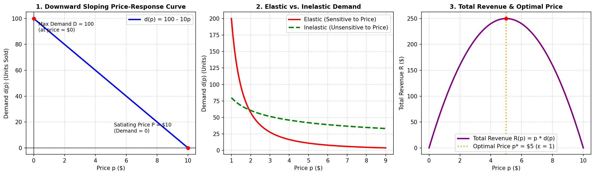
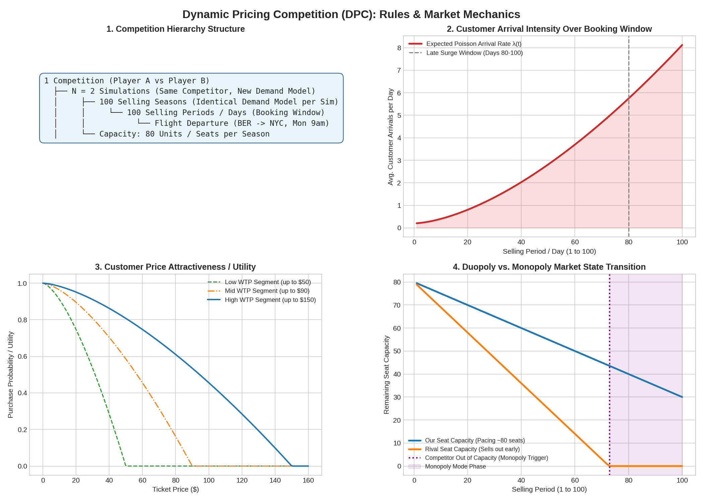
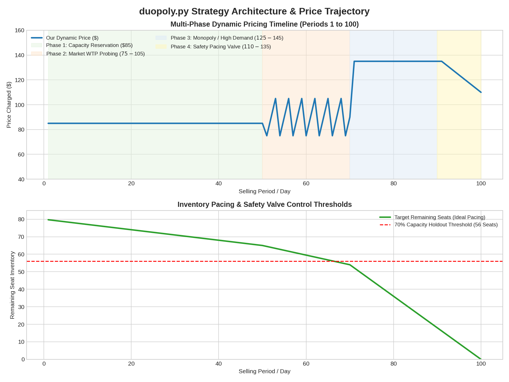

# Dynamic Pricing Competition (DPC): Strategy, Microeconomics & Technical Blueprint

An executive technical documentation, microeconomic foundation, and algorithmic blueprint for competing in the **Dynamic Pricing Competition (DPC)** with our custom pricing algorithm, `duopoly.py`.

---

## 1. Microeconomic Foundations of Dynamic Pricing

Dynamic pricing in perishable inventory systems combines consumer utility theory, price-response estimation, and inventory opportunity costing [2].

### 1.1 Price-Response Function & Willingness to Pay (WTP)

Let each customer arriving in the market have a reservation price (Willingness to Pay) $w \ge 0$, drawn from a cumulative distribution $F(w)$ with probability density $f(w)$ [2]. A customer purchases a seat at price $p$ if and only if their valuation exceeds the asking price:

$$d(p) = D \cdot \Pr(w \ge p) = D \cdot [1 - F(p)]$$

where:
* $D$ is the total market arrival volume (market size) in the given period.
* $d(p)$ is the realized demand at price $p$, satisfying the standard monotonicity condition:

$$\frac{\mathrm{d}d(p)}{\mathrm{d}p} \le 0$$

```
     Demand d(p)
         ▲
       D ┼──────────────┐
         │              │  Consumer Surplus
         │              └────────┐
         │                       │
         │ Realized Demand d(p*) ├───┐
         │                       │   │ Unsold / Priced Out
       0 ┴───────────────────────┴───┴─────────► Price p
                                 p*  p_max
```

### 1.2 Price Elasticity of Demand

Price elasticity $\epsilon(p)$ measures the percentage change in demand relative to a percentage change in price [2]:

$$\epsilon(p) = - \frac{p}{d(p)} \frac{\mathrm{d}d(p)}{\mathrm{d}p}$$

| Elasticity Regime | Value | Economic Implication | Optimal Action |
| :--- | :---: | :--- | :--- |
| **Inelastic Demand** | $\epsilon(p) < 1$ | Demand drops less (%) than price rises (%) | **Increase price** to raise total revenue |
| **Unitary Elasticity** | $\epsilon(p) = 1$ | Marginal revenue equals zero ($MR = 0$) | **Revenue-maximizing price** $p^*$ |
| **Elastic Demand** | $\epsilon(p) > 1$ | Demand drops more (%) than price rises (%) | **Decrease price** to stimulate demand |

### 1.3 Revenue Maximization & Marginal Revenue

Expected revenue $R(p)$ is defined as price multiplied by demand [2]:

$$R(p) = p \cdot d(p)$$

Differentiating with respect to price yields the marginal revenue condition:

$$\frac{\mathrm{d}R(p)}{\mathrm{d}p} = d(p) + p \frac{\mathrm{d}d(p)}{\mathrm{d}p} = d(p) \cdot \left[1 - \epsilon(p)\right] = 0 \iff \epsilon(p^*) = 1$$

Under a linear price-response curve $d(p) = D - b \cdot p$ (with satiating price $P = D/b$), revenue forms a concave parabola maximized at $p^* = \frac{D}{2b}$, where demand is $d(p^*) = \frac{D}{2}$ [2].



* **Panel 1 (Downward Sloping Curve):** Depicts linear demand $d(p) = 100 - 10p$ with maximum demand $D = 100$ at price $p = 0$ and zero demand at satiating price $P = 10$.
* **Panel 2 (Elastic vs. Inelastic Demand):** Demonstrates price-sensitive demand curves (high elasticity) versus essential/business demand curves (inelastic).
* **Panel 3 (Total Revenue & Optimal Price):** Shows total revenue $R(p) = p \cdot d(p)$ achieving its global peak at $p^* = 5$, exactly where $\epsilon = 1$.

### 1.4 Perishable Capacity & Opportunity Cost

In airline revenue management, seats are strictly perishable: inventory cannot be replenished, and unsold seats at departure time $T = 100$ have a salvage value of zero. The effective optimal price must account for the **shadow price (opportunity cost of capacity)** $\mu(t, c)$:

$$p^*(t, c) = \arg\max_{p} \left\{ (p - \mu(t, c)) \cdot d(p, t) \right\}$$

As remaining capacity $c$ diminishes relative to remaining periods $T - t$, the shadow price $\mu(t, c)$ escalates, justifying higher price thresholds to protect inventory for high-value business travelers arriving late in the season [2].

---

## 2. DPC Game Rules & Simulation Mechanics

The **Dynamic Pricing Competition (DPC)** evaluates autonomous pricing agents under competitive airline duopoly market conditions [1, 3].

```
                                  COMPETITION
                           (Player A vs. Player B)
                                      │
                   ┌──────────────────┴──────────────────┐
                   ▼                                     ▼
             Simulation 1                          Simulation 2
        (Demand Model: Alpha)                 (Demand Model: Beta)
                   │                                     │
       ┌───────────┴───────────┐             ┌───────────┴───────────┐
       ▼                       ▼             ▼                       ▼
Selling Season 1  ... Selling Season 100  Selling Season 1 ... Selling Season 100
 (Periods 1..100)       (Periods 1..100)   (Periods 1..100)      (Periods 1..100)
```

### 2.1 Structural Hierarchy

1. **Competition Match:** Two competitors are randomly paired by the DPC matchmaking engine to compete against each other [1, 3].
2. **Simulations ($N=2$):** A competition comprises $N=2$ independent simulations. Each simulation synthesizes a new, randomized underlying market demand model [3].
3. **Selling Seasons ($1 \dots 100$):** Each simulation runs for 100 identical selling seasons (representing 100 recurring flight departures on the BER $\to$ JFK route). The demand model is **held constant across all 100 seasons** within a simulation, allowing cross-season learning [3].
4. **Selling Periods ($1 \dots 100$, plus 101):** Each season consists of 100 discrete daily booking periods.
   > [!NOTE]
   > The simulation platform actually executes **101 time periods** per season so that the algorithm receives feedback (competitor price and realized demand) from period 100. The price returned in period 101 is discarded and not evaluated [1].
5. **Capacity Constraint:** Both competitors start every season with a fixed inventory of **80 seats** [1, 3]. Inventory cannot be replenished. Unsold seats at period 100 expire with zero value.
6. **Winning Metric:** The overall winner is the player with the highest **cumulative total revenue** across all simulations [1, 3].

### 2.2 Customer Demand & Duopoly Market Dynamics

* **Poisson Customer Arrivals:** In each period $t \in [1, 100]$, the number of potential customer arrivals follows a Poisson process with arrival intensity $\lambda(t)$ [3]:
  $$\Pr(K = k) = \frac{\lambda(t)^k e^{-\lambda(t)}}{k!}$$
  Arrival intensity $\lambda(t)$ **rises steeply toward flight departure**, peaking dramatically in periods $80 \dots 100$ (late business travelers) [3].
* **Customer Utility Function:** Arriving buyers evaluate seat offers using a random utility model:
  $$U_i(p) = w_i - p$$
  Lower prices offer higher attractiveness. Market share is split between Player A and Player B based on both absolute price levels and relative price differentials [1, 3].
* **Monopoly State Transition:** If one airline exhausts all 80 seats prior to period 100, that airline becomes sold out (`competitor_has_capacity == False`) [1, 3]. The surviving airline captures 100% of the remaining market arrivals as an unconstrained **monopoly seller** [3].



* **Panel 1 (Competition Hierarchy):** Full structural tree from Competition down to Simulations, Selling Seasons, and Selling Periods.
* **Panel 2 (Poisson Arrival Intensity):** Depicts $\lambda(t)$ accelerating from low baseline intensity in early days to peak arrival volumes near flight departure.
* **Panel 3 (Utility & Willingness to Pay):** Illustrates customer utility curves across Budget (\$50), Leisure (\$90), and Business (\$150) traveler segments.
* **Panel 4 (Duopoly to Monopoly Transition):** State machine demonstrating the automatic transition to Monopoly mode when a rival depletes their 80-seat inventory.

---

## 3. Platform Architecture & Technical Requirements

Algorithms run autonomously inside isolated sandboxes on AWS infrastructure [1].

### 3.1 Container Runtime & Hardware Limits

* **Environment:** AWS Docker container with **Python 3.12.9** and **Anaconda 2025.06** [1].
* **Pre-installed Libraries:** `numpy`, `pandas` (2.3.3), `scipy`, `scikit-learn`, `pytorch` (2.5.1), `tensorflow` (2.19.1), `xgboost` (3.0.5), `botorch` (0.15.1), `pyomo` (6.9.4), `glpk` (5.0), and `ipopt` (3.14.19) [1].
* **Compute Resources:** **1 vCPU**, **512 MB RAM** [1].
* **Execution Latency:**
  * Average latency: **≤ 0.2 seconds** per iteration [1].
  * Maximum hard limit: **5.0 seconds** per single call [1].
* **Reliability:** Minimum **99% error-free execution** rate required. In case of invalid prices or errors, fallback mechanisms revert to previous period prices or random draws [1].
* **I/O Policy:** No terminal printing (`stdout` is not logged). File writing must adhere to designated feedback channels [1].

### 3.2 Pricing Function Interface (`duopoly.py`)

Submissions must consist of a file named [`duopoly.py`](file:///c:/Users/ramiz/OneDrive/Desktop/BHT/BHT%20-%20Assignments/Semester%203/Learning%20Optimization/duopoly.py) implementing the required signature [1]:

```python
from typing import Any, Optional, Tuple, Union
import numpy as np

def p(
    current_selling_season: int,
    selling_period_in_current_season: int,
    prices_historical_in_current_season: Union[np.ndarray, None],
    demand_historical_in_current_season: Union[np.ndarray, None],
    competitor_has_capacity_current_period_in_current_season: bool,
    information_dump: Optional[Any] = None,
) -> Tuple[float, Any]:
    """Computes the optimal price for the current selling period."""
    ...
    return price, information_dump
```

#### Argument Definitions:

| Argument | Type | Description |
| :--- | :---: | :--- |
| `current_selling_season` | `int` | Current season index ($1 \dots 100$) [1, 3]. |
| `selling_period_in_current_season` | `int` | Current period index ($1 \dots 100$, up to 101) [1, 3]. |
| `prices_historical_in_current_season` | `ndarray \| None` | 2D array of shape `(n_competitors, past_periods)`. Rows = players, columns = periods. `None` in period 1 [1, 3]. |
| `demand_historical_in_current_season` | `ndarray \| None` | 1D array of shape `(past_periods,)` — your own realized demand. `None` in period 1 [1, 3]. |
| `competitor_has_capacity_...` | `bool` | `False` if the competitor is out of stock; `True` otherwise [1, 3]. |
| `information_dump` | `Any \| None` | Custom in-memory state object returned to you next period. `None` in period 1 of season 1 [1, 3]. |

### 3.3 State Persistence & Data Handshake Tiers

```
┌────────────────────────────────────────────────────────────────────────┐
│                        STATE PERSISTENCE TIERS                         │
├────────────────────────────────┬───────────────────────────────────────┤
│ Tier 1: Intra-Season Memory    │ `prices_historical`, `demand_hist`    │
│                                │ Real-time observations within season  │
├────────────────────────────────┼───────────────────────────────────────┤
│ Tier 2: Inter-Season Memory    │ `information_dump`                    │
│                                │ Persists across seasons (1..100)      │
│                                │ Reset to None between competitions   │
├────────────────────────────────┼───────────────────────────────────────┤
│ Tier 3: Inter-Competition File │ `duopoly_feedback.data`               │
│                                │ Persists across nightly match runs    │
│                                │ Downloadable via DPC web dashboard    │
└────────────────────────────────┴───────────────────────────────────────┘
```

1. **Tier 1 (Intra-Season):** Evaluated from `prices_historical_in_current_season` and `demand_historical_in_current_season`.
2. **Tier 2 (Inter-Season `information_dump`):** In-memory dictionary or custom class persisting knowledge across all 100 seasons of a single competition (e.g., rival pricing patterns, estimated demand elasticity $\hat{\epsilon}$) [1, 3].
3. **Tier 3 (Inter-Competition `duopoly_feedback.data`):** Dedicated local file persisted across nightly simulation runs [1, 3]:
   ```python
   import pickle
   # Save state for UI download and future nightly runs
   with open("duopoly_feedback.data", "wb") as f:
       pickle.dump(feedback_payload, f, protocol=pickle.HIGHEST_PROTOCOL)
   ```
4. **Pre-trained Artifacts:** Additional files (e.g., serialized models) can be loaded using the container path with local fallback [1]:
   ```python
   import pickle
   for path in ["/root/participant_folder/model.pkl", "/root/partcipant_folder/model.pkl", "model.pkl"]:
       try:
           with open(path, "rb") as f:
               model = pickle.load(f)
           break
       except FileNotFoundError:
           continue
   ```

### 3.4 Evaluation Results Schema

After every competition run, a comprehensive CSV report is generated containing the following schema [1, 3]:

| Column Name | Data Type | Description |
| :--- | :---: | :--- |
| `competition_id` | `str / int` | Unique identifier of the competition run [1, 3]. |
| `selling_season` | `int` | Season number (1–100) [1, 3]. |
| `selling_period` | `int` | Period number (1–100) [1, 3]. |
| `competitor_id` | `str` | Name / identifier of rival algorithm [1, 3]. |
| `price_competitor` | `float` | Price posted by rival in that period [1, 3]. |
| `price` | `float` | Price posted by our algorithm [1, 3]. |
| `demand` | `int` | Realized sales volume (Revenue = `price` × `demand`) [1, 3]. |
| `competitor_has_capacity` | `bool` | Stock availability of rival (`True` / `False`) [1, 3]. |
| `calculation_duration` | `float` | Algorithm response time in seconds [1, 3]. |

---

## 4. Our Strategic Pricing Architecture (`duopoly.py`)

Our algorithm in [`duopoly.py`](file:///c:/Users/ramiz/OneDrive/Desktop/BHT/BHT%20-%20Assignments/Semester%203/Learning%20Optimization/duopoly.py) implements a four-phase pricing framework designed to exploit market asymmetries, protect perishable inventory, probe customer price elasticity, and maximize revenue during the late-season surge.

| | Phase 1: Capacity Holdout | Phase 2: Market Probing | Phase 3: High Demand | Phase 4: Safety Pacing Valve |
| :--- | :--- | :--- | :--- | :--- |
| **Periods** | 1–50 | 51–70 | 71–89 | 90–100 |
| **Strategy** | Hold ~70% capacity | Test \$75, \$90, \$105 | Monopoly: \$105–\$145 | Monitor seats/day |
| **Details** | Baseline price: \$85 | Estimate elasticity | Duopoly: Undercut/Hold | Eliminate zero-salvage spoilage |

### 4.1 Phase 1: Early Capacity Holdout (Periods 1–50)

* **Economic Objective:** Poisson arrival rates $\lambda(t)$ are low during early days. Selling early sacrifices inventory for low revenue. We protect **~70% of capacity (at least 56 seats)** for periods 71–100 [3].
* **Execution:** Set a firm baseline price of **\$85.00**. This filters out low-margin bargain hunters while still capturing occasional high-valuation leisure buyers [2].

### 4.2 Phase 2: Active Market Probing (Periods 51–70)

* **Economic Objective:** Uncover customer price elasticity $\epsilon(p)$ and rival behavioral patterns before the high-demand surge.
* **Execution:** Systematically rotate through pricing probes:
  * **High Probe (\$105.00):** Tests high-end reservation price thresholds.
  * **Baseline (\$90.00):** Sustains steady sales pace.
  * **Low Probe (\$75.00):** Measures volume responsiveness and elasticity sensitivity.
* Realized sales and competitor responses are logged into `information_dump` to refine elasticity estimates.

### 4.3 Phase 3: High-Demand & Monopoly Exploitation (Periods 71–90)

* **Economic Objective:** Poisson arrivals reach peak intensity $\lambda(t)$, and business travelers exhibit steep willingness to pay (up to \$150.00) [2, 3].
* **Monopoly Regime (`competitor_has_capacity == False`):**
  * Competitor has sold out. With zero rival alternatives, we price along the pure monopoly demand curve:
    * ≤ 15 seats remaining: **\$145.00** (extreme scarcity premium).
    * 16–35 seats remaining: **\$125.00** (balanced extraction).
    * Over 35 seats remaining: **\$105.00** (accelerated volume absorption).
* **Duopoly Regime (`competitor_has_capacity == True`):**
  * **Rival Pricing High (≥ \$120.00):** Slightly undercut ($p_{\text{rival}} - 5$) to capture high-margin demand.
  * **Rival Dumping (≤ \$70.00):** Do not follow into a destructive price war. Hold price firm at **\$105.00**, allowing the competitor to rapidly deplete their 80 seats and hand us the monopoly for the remaining periods.
  * **Rival Balanced (\$70.00 to \$120.00):** Post $\max(85,\; p_{\text{rival}} - 2)$ to maintain competitive market share.

### 4.4 Phase 4: Dynamic Safety Pacing Valve (Periods 90–100)

* **Economic Objective:** Eliminate seat spoilage. At period 100, unsold seats yield \$0.00 [2].
* **Execution:** Compute the burn rate ratio:

$$\text{Burn Rate} = \frac{\text{Remaining Capacity}}{\max(1,\; 101 - t)}$$

If Burn Rate > 1.5 seats/day, trigger the pacing valve by discounting price proportionally:

$$p_{\text{valve}} = \max\!\left(60,\; p_{\text{target}} - \text{Burn Rate} \times 10\right)$$

ensuring full inventory clearance while preserving the \$60.00 price floor.



* **Panel 1 (Strategy Timeline):** Timeline detailing pricing decisions and behavioral rules across Phase 1, Phase 2, Phase 3, and Phase 4.
* **Panel 2 (Capacity Trajectory):** Planned seat depletion curve bounded by the 70% holdout line (56 seats) and the late-stage safety pacing valve.

---

## 5. Local Simulation & Submission Workflow

### 5.1 Verification Checklist

Before submitting [`duopoly.py`](file:///c:/Users/ramiz/OneDrive/Desktop/BHT/BHT%20-%20Assignments/Semester%203/Learning%20Optimization/duopoly.py) to the DPC platform:

- [x] File named strictly `duopoly.py`.
- [x] Pricing function `p(...)` adheres to the exact signature and argument types.
- [x] Output price is clipped within valid competition bounds (\$30.00–\$150.00).
- [x] Handles `None` inputs on period 1 (`prices_historical`, `demand_historical`).
- [x] Handles period 101 gracefully without throwing exceptions.
- [x] Average execution latency well below the 0.2-second limit (~0.001s per call).
- [x] Memory usage within 512 MB.
- [x] No unauthorized file system writes or terminal output logging.

### 5.2 Uploading to the DPC Platform

1. Log in to [dynamic-pricing-competition.com](https://www.dynamic-pricing-competition.com/).
2. Navigate to **File Manager** in the dashboard.
3. Upload `duopoly.py` (and any auxiliary pickled model files).
4. Inspect cloud test run results and error logs generated after ~15 minutes.
5. Review daily leaderboard rankings and download the detailed simulation CSV log.

---

## 6. Glossary of Business, Microeconomic & Technical Terms

Below is an executive glossary defining key economic, revenue management, and competition concepts in plain language for non-specialists.

### 6.1 Market & Economic Concepts

| Term | Plain-Language Definition | Practical Meaning in the Competition |
| :--- | :--- | :--- |
| **Market Size ($D$)** | The total number of potential customers looking for a flight ticket during a given time period. | Sets the ceiling on how many tickets can possibly be sold in that day if prices are accessible. |
| **Willingness to Pay (WTP)** | The maximum dollar amount an individual customer is prepared to spend on a seat (also called *Reservation Price*). | If ticket price exceeds a buyer's WTP, they walk away without buying. If price is at or below WTP, they consider purchasing. |
| **Consumer Surplus** | The perceived financial gain a customer enjoys when paying less than their maximum WTP. | If a traveler valued the flight at \$120 and bought it for \$85, their consumer surplus is \$35. Lower prices create higher surplus. |
| **Price Elasticity of Demand ($\epsilon$)** | A measure of how strongly customer purchase decisions react to changes in ticket price. | High elasticity means raising prices drives customers away. Low elasticity means customers need the seat urgently and tolerate high prices. |
| **Inelastic Demand** | When a percentage increase in price causes only a small drop in sales volume. | Characteristic of late-booking business flyers. Raising prices increases total revenue. |
| **Elastic Demand** | When a percentage increase in price causes a large drop in sales volume. | Characteristic of early vacationers with flexible plans. Lowering prices stimulates sales volume. |
| **Marginal Revenue ($MR$)** | The net extra revenue generated by selling one additional seat. | Revenue is maximized at the exact price point where marginal revenue drops to zero ($MR = 0$). |

### 6.2 Revenue Management & Airline Operations

| Term | Plain-Language Definition | Practical Meaning in the Competition |
| :--- | :--- | :--- |
| **Dynamic Pricing** | The practice of adjusting prices in real time based on demand fluctuations, remaining time, and inventory levels. | Instead of charging one static fare, our algorithm continuously sets optimal prices for all 100 booking periods. |
| **Perishable Inventory** | Goods or services that expire and become completely worthless after a fixed date or event. | Airline seats are strictly perishable: once the aircraft takes off, an unsold seat has zero utility and cannot be recovered. |
| **Seat Spoilage** | Leaving seats empty and unsold when the flight departs at period 100. | Spoilage is wasted potential revenue; our Phase 4 Safety Valve actively prevents this by discounting prices if seats remain late. |
| **Salvage Value** | The residual value of unsold stock after the sales period concludes. | In airline booking, salvage value is exactly \$0. Unsold inventory cannot be discounted or sold after departure. |
| **Opportunity Cost / Shadow Price ($\mu$)** | The hidden economic cost of selling a seat today instead of reserving it for a potentially higher-paying buyer tomorrow. | Selling a seat early for \$85 carries an opportunity cost if a business traveler would have paid \$145 in period 90. |
| **Poisson Arrival Process ($\lambda$)** | A standard statistical model describing how random events (customer arrivals) occur over time at an average rate $\lambda$. | Models passenger booking traffic, which starts as a slow trickle early on and escalates sharply in days 80–100. |
| **Burn Rate** | The pace at which remaining seats must sell each day to completely sell out before departure. | Calculated as Remaining Capacity divided by Days Left. A burn rate above 1.5 indicates seats are selling too slowly. |
| **Safety Pacing Valve** | An automated algorithmic override that lowers prices if inventory is selling slower than the target trajectory. | Ensures inventory clears before period 100 without initiating an unnecessary price war earlier in the season. |

### 6.3 Duopoly Game & Technical Architecture

| Term | Plain-Language Definition | Practical Meaning in the Competition |
| :--- | :--- | :--- |
| **Duopoly** | A market structure where exactly two commercial competitors supply the entire market. | Player A and Player B share all market arrivals; pricing decisions directly affect each other's sales volume. |
| **Monopoly** | A market structure with only a single supplier and zero competing alternatives. | When a rival exhausts all 80 seats, we become the monopoly seller and can charge up to \$145 without risk of being undercut. |
| **Price Dumping** | Aggressively undercutting prices to capture short-term volume at unsustainably low margins. | If a rival dumps tickets below \$70, we do not follow them; we let them deplete their inventory early and hand us the monopoly. |
| **Selling Season** | One complete 100-day booking timeline for a single scheduled flight departure. | Each competition simulation repeats 100 seasons with identical market parameters, allowing cross-season learning. |
| **Selling Period** | A single day or time step within the 100-day booking timeline. | There are 100 active periods plus period 101, which delivers final feedback from period 100. |
| **Information Dump (`information_dump`)** | A persistent Python data structure passed between consecutive decision steps. | Enables our algorithm to store state across periods and seasons without violating Docker sandbox memory constraints. |

---

## 7. References & Literature

* **[1] Dynamic Pricing Competition (DPC)** (2025/2026). *Rules, Architecture & Getting Started Guide*. Available at: [dynamic-pricing-competition.com](https://www.dynamic-pricing-competition.com/).
* **[2] Phillips, Robert L.** (2005 / 2021). *Pricing and Revenue Optimization*. Stanford University Press, Stanford Business Books. ISBN: 978-0804746984.
* **[3] Winter, Thomas & Haensel, Alwin** (2025/2026). *Learning Optimization: Dynamic Pricing & DPC*. Course Materials and Lecture Notes, Berliner Hochschule für Technik (BHT).
* **[4] Anand, Anush; Agrawal, Pranav; & Bodas, Tejas** (2024). *Bayesian Optimization for Dynamic Pricing and Learning in Duopoly Competitions*. International Institute of Information Technology (IIIT Hyderabad).
* **[5] Talluri, Kalyan T. & van Ryzin, Garrett J.** (2004). *The Theory and Practice of Revenue Management*. Springer Science & Business Media.
